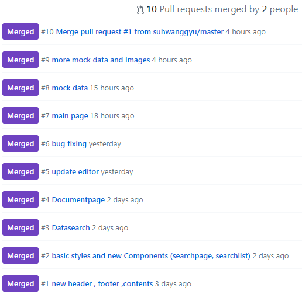

<h1 align="center"> Manual Hub</h1>


## '2019년 군장병 공개SW 집체교육'(2019.10.21~2019.10.25)


<p align="center">
  
</p>

### 프로젝트 설명
```
업무 담당자의 잦은 교체와 다양한 문제상황에 부딪히는 군 업무 특성을 기반으로,
실무 매뉴얼 문서화 통합을  통한 실무 능력 유지와 
자주 쓰이는 문서 양식 을 등록하여 일지관리, 빠른 신청 등
업무 담당자의 업무 처리속도를 향상 시킬 수 있는 정보시스템의 프론트 엔드를 개발한다
```


### 관등성명
```
  공군 작전정보통신단 체계운영대대 기반체계운영중대 체계통제반 ***병장 서왕규***

  육군 5군단 5공병여단 정보통신과 체계반 일병 이종법
```

### 개발 명세서 
>여기 파일 다운로드 넣을 


### 1. 컴퓨터 구성 / 필수 조건 안내 (Prerequisites)
```
1. 최신버전 Chrome
2. Node.js, NPM
3. Vue.js
4. javascript 지원 컴파일러
```

### 2. 설치안내 ( Project Setup )


```
1. 현재 리모트 저장소를 clone 해준다.

 git clone 저장소
 
2. directory를 clone 해준 위치로 이동한다.

 cd [clone장소]
 
3. 해당 디렉토리에서 node_modules를 설치해준다

 npm install
 
```


### 3. 사용법 ( Getting Started )
  ```
  1. directory를 clone 해준 위치로 이동한다.
  
   cd [clone space]
   
  2. 컴파일 해주고 로컬 호스트 서버를 켜준다.
  
   npm run serve
   
  3. 로컬 호스트 주소로 접속한다!
  
  ```


### 4. 파일 정보 및 목록 ( File Manifest )
|디렉토리|파일|설명|
|------|---|---|
|public/image|0~3.jpg|사용자 그룹별 이미지|
|public/image|그외 .jpg 파일|MOCKUP 데이터에 필요한 사진|
|src|App.vue| Vue 컴포넌트들의 Head 컴포넌트|
|src/components|store.js| vuex 글로벌 변수 모음파일 |
|src/components|TopHeader.vue|페이지 헤더|
|src/components|MainFooter.vue|페이지 푸터|
|src/components|**MainContent.vue**|**메인 read 페이지**|
|src/components|**NewsContent.vue**|**메인 news 페이지**|
|src/components|LoginContent.vue|메인 로그인 페이지|
|src/components|SearchPage.vue|read 페이지의 search 페이지|
|src/components|SearchTab.vue|search 페이지 검색창|
|src/components|SearchList.vue|search 페이지 검색리스트|
|src/components|PlusButton.vue|글쓰기 버튼|
|src/components|**HistoryPage.vue**| 해당 문서 작업 이력 리스트 ( History 체크 할 경우 search와 교체 )|
|src/components|DocumentPage.vue|read 페이지의 문서창|
|src/components|ReadHeader.vue|document 페이지의 헤더(제목,수정하기,작성자 등등)|
|src/components|CarouselPage.vue|document 페이지의 내용( 문서 열람 )|
|src/components|DocumentEditor.vue| 문서 Editor 페이지 ( 수정하기, 글 작성 눌렀을 경우 document페이지와 교체 )|
|src/components|EditMode.vue|Editor 페이지의 헤더( 수정하기 눌렀을 경우)|
|src/components|WriteMode.vue|글 작성 Header (Plus버튼 눌렀을 경우 ReadHeader 와 교체)|
|src/components/newscomponent|DepartMember.vue|news 페이지 부서원 탭|
|src/components/newscomponent|Newnews.vue|news 페이지 최근 추가된 history list를 보여주는 탭|
|src/components/newscomponent|RecentRead.vue|news 페이지 읽었던 문서 list를 보여주는 탭|

> 자세한 사항의 소프트웨어 설계서 참조 ( 파일이름 )

### 5. 저작권 및 사용권 정보 (Copyright / End User License)
> MIT License

### 6. 배포자 및 개발자의 연락처 정보 (Contact Information)
> 서왕규 : wang1@hanyang.ac.kr


> 이종법 : bub3690@naver.com

### 7. 알려진 버그 (Known Issues)
> 기존 문서의 로드에서, 현재 사용하는 editor package 로는 읽지 못하는 문서가 존재.
### 8. 문제 발생에 대한 해결책 (Troubleshooting)
> 대회 종료 후, vue2-editor 보다 호환성이 뛰어난 editor를 사용해야함.
### 9. credit
```
  "dependencies": {
    "axios": "^0.19.0",
    "core-js": "^3.1.2",
    "credits": "^2.1.0",
    "element-ui": "^2.12.0",
    "vue": "^2.6.10",
    "vue-axios": "^2.1.5",
    "vue-router": "^3.1.3",
    "vue2-editor": "^2.10.2",
    "vuex": "^3.1.1"
  }
```
### 10. 업데이트 정보 (Change Log)
주요 커밋 로그

  


